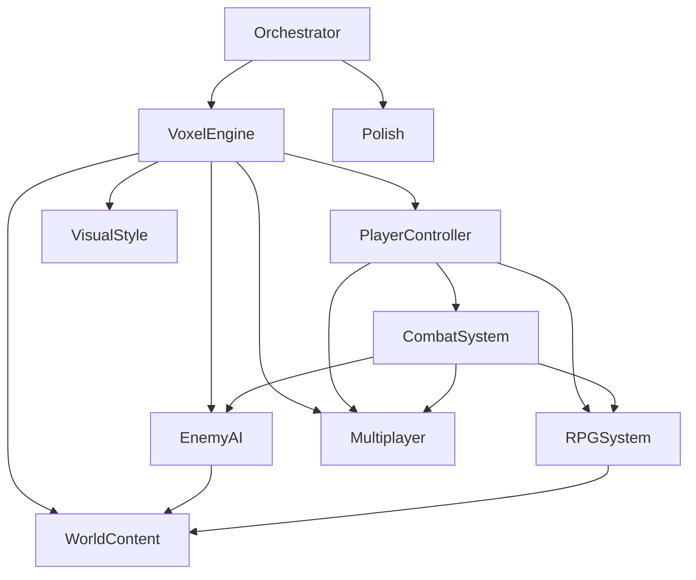

# 🎯 Итоговая структура мультиагентной системы

## ✅ Создано

### Папки агентов (10)
1. ✅ `orchestrator/` — Главный координатор
2. ✅ `voxel-engine/` — Воксельный движок  
3. ✅ `player-controller/` — Контроль игрока
4. ✅ `visual-style/` — Визуальный стиль
5. ✅ `combat-system/` — Боевая система
6. ✅ `enemy-ai/` — ИИ врагов
7. ✅ `rpg-system/` — RPG механики
8. ✅ `world-content/` — Контент мира
9. ✅ `multiplayer/` — Мультиплеер (опционально)
10. ✅ `polish/` — Полировка

### Файлы конфигурации
- ✅ `README.md` — Общий обзор системы
- ✅ `orchestrator/role.md` — Роль координатора
- ✅ `orchestrator/tasks.md` — Задачи по фазам
- ✅ `orchestrator/instructions.md` — Детальные инструкции

### Роли агентов (role.md)
- ✅ VoxelEngine — Фаза 1 (воксельный движок)
- ✅ PlayerController — Фаза 2 (игрок и камера)
- ✅ VisualStyle — Фаза 3 (визуал)
- ✅ CombatSystem — Фаза 4 (боевая система)
- ✅ EnemyAI — Фаза 5 (враги и AI)
- ✅ RPGSystem — Фаза 6 (RPG механики)
- ✅ WorldContent — Фаза 7 (контент мира)
- ✅ Multiplayer — Фаза 8 (мультиплеер)
- ✅ Polish — Фаза 9 (полировка)

### Задачи агентов (tasks.md)
- ✅ Orchestrator — Общие задачи проекта
- ✅ VoxelEngine — Фаза 1.1-1.5
- ✅ PlayerController — Фаза 2.1-2.3
- ✅ CombatSystem — Фаза 4.1-4.6
- ✅ EnemyAI — Фаза 5.1-5.5
- ✅ RPGSystem — Фаза 6.1-6.5

## 📊 Статистика

**Всего агентов:** 10
**Файлов создано:** 20+
**Фаз разработки:** 10 (0-9)
**Этапов разработки:** 50+

## 🚀 Как начать работу

### Шаг 1: Ознакомление
```bash
# Прочитайте главный README
cat my-agent/README.md

# Изучите план проекта
cat cube_world_plan.md
```

### Шаг 2: Инициализация
Обратитесь к Orchestrator Agent:
```
Привет, Orchestrator! Начинаем проект Cube World.
Текущая фаза: 0 (Подготовка)
Что нужно сделать?
```

### Шаг 3: Следуйте плану
Orchestrator будет координировать работу всех агентов согласно плану.

## 🎯 Приоритеты выполнения

### Критические (делать в первую очередь)
1. 🔴 **VoxelEngine** (Фаза 1) — фундамент игры
2. 🔴 **PlayerController** (Фаза 2) — базовое управление
3. 🔴 **CombatSystem** (Фаза 4) — core gameplay
4. 🔴 **EnemyAI** (Фаза 5) — противники

### Важные (делать после критических)
5. 🟡 **VisualStyle** (Фаза 3) — красота
6. 🟡 **RPGSystem** (Фаза 6) — прогрессия

### Желательные (делать ближе к концу)
7. 🟢 **WorldContent** (Фаза 7) — наполнение
8. 🟢 **Polish** (Фаза 9) — полировка

### Опциональные (делать в последнюю очередь)
9. ⚪ **Multiplayer** (Фаза 8) — только если хватит сил

## 📈 Прогресс

### Фаза 0: Подготовка
- [x] Создана структура агентов
- [ ] Unity 2022.3 LTS установлен
- [ ] Структура папок Assets настроена
- [ ] Git настроен
- [ ] Базовые ассеты импортированы

### Фазы 1-9
- [ ] Все задачи в ожидании

## 💡 Полезные команды

### Просмотр задач агента
```bash
# Orchestrator
cat my-agent/orchestrator/tasks.md

# VoxelEngine
cat my-agent/voxel-engine/tasks.md

# Любой другой агент
cat my-agent/{agent-name}/tasks.md
```

### Проверка роли агента
```bash
cat my-agent/{agent-name}/role.md
```

## 🔗 Зависимости между агентами



## 📝 Следующие шаги

1. **Проверьте установку Unity 2022.3 LTS**
2. **Создайте структуру папок в Assets/**
3. **Настройте Git и .gitignore**
4. **Начните с Фазы 1.1** (Базовый чанк)

## 🎊 Готово!

Мультиагентная система успешно создана и готова к использованию!

Следуйте инструкциям Orchestrator и создавайте свою Cube World игру! 🎮

---

*Удачи в разработке!*